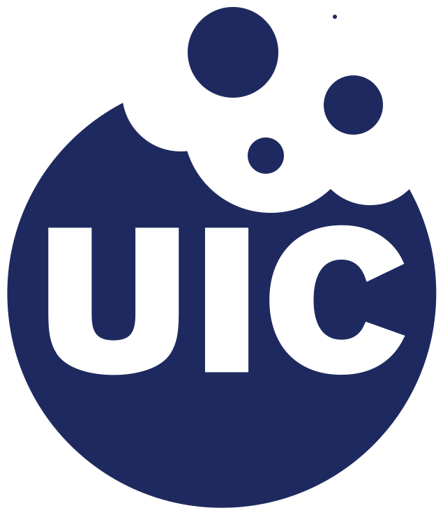

#  &nbsp; UICbites
sharing crumbs of knowledge around UIC

## Full Stack Group Project - TEAM 12 
VISIT [UICBITES](https://abyssaldragonz.github.io/UICbites/)

<!-- This repository is a template for your Full Stack Group Project. It includes a basic project structure, along with Markdown examples for weekly meeting notes and the project README.  

Use this repository to store your code and collaborate throughout all FGP stages, starting from FGP3.   -->

<!-- **Note:** This layout is an example. The official requirements for your project README will be provided later in the course.   -->

## 🚀 About<!-- Required -->
<!-- 
* information about the project 
* 
* keep it short and sweet
-->
This website helps students find options around campus based on what they require from the restaurant.

The goal is to provide students with a resource to find affordable food options close to campus.


## ⚙️ How to use this project<!-- Required -->
<!-- 
* Here you may add information about how 
* 
* and why to use this project.
-->
This website compiles 60 different food options around UIC campus, with the distances measured from Student Center East (SCE). This information is compiled into two pages. <br> <br>

The home page features a search bar, where restaurant names can be inputted; when entering the a letter, all the restaurants in the database that starts with that letter will appear. The highlight of the week is also featured on this page, along with the top five rated restaurants from the dataset. <br> <br>

The explore pages features all the food options around UIC, with an option to filter the search, such as by distance, by rating, if they accept FlamesFare, or contain student discounts. Each of the restaurant cards feature the address, the distance from UIC SCE, the rating as seen on Google Maps, and the current day's opening hours, if the restaurant have scheduled hours. Clicking on the cards opens up details about the restaurant, such as the full opening hours and the directions to the restaurant from SCE. 


## 📝 Demo<!-- Required -->
<!-- 
* You can add a demo here GH supports images/ GIFs/videos 
* 
* It's recommended to use GIFs as they are more dynamic
-->
**[Click here for a full video demo!](https://www.youtube.com/watch?v=bzxj5YOFMT8)**

Here is a GIF!


## 🪶 Table of Contents<!-- Optional -->
<!-- 
* This section is optional, yet having a contents table 
* helps keeping your README readable and more professional.
* 
* If you are not familiar with HTML, no worries we all been there :D 
* Review learning resources to create anchor links. 
-->

<dev align="center">
    <table align="center">
        <tr>
            <td><a href="#about">About</a></td>        
            <td><a href="#how-to-use-this-project">Getting started</td>
            <td><a href="#demo">Demo</a></td>
            <td><a href="#project-roadmap--">Project Roadmap</a></td>
            <td><a href="#documentation">Documentation</a></td>
        </tr>
        <tr>
            <td><a href="#contributors">Contributors</a></td>
            <td><a href="#acknowledgments">Acknowledgments</a></td>
            <td><a href="#feedback">Feedback</a></td>
            <td><a href="#contact">Contact</a></td>
            <td><a href="#license">License</a></td>
        </tr>
    </table>
</dev>


<!-- - Use this html element to create a back to top button. -->
<p align="right"><a href="#how-to-use-this-project">back to top ⬆️</a></p>


## 📌 Project Roadmap <!-- Optional --> <!-- add learning_Rs-->
<!-- 
* Add this section in case the project has different phases
* 
* Under production or will be updated.
-->
* [Figma!](https://www.figma.com/design/5VUkqPckBIicIMbQrbk4jS/CS-351-FGP?node-id=0-1&t=RyXG59s1DJZJwMDl-1)
* ReactJS + Vite for frontend
* Python + Flask for backend


<!-- - Use this html element to create a back to top button. -->
<p align="right"><a href="#how-to-use-this-project">back to top ⬆️</a></p>


## 📜 Documentation<!-- Optional -->
<!-- 
* You may add any documentation or Wikis here
* 
* 
-->
Project structure:
```
/
├── backend/
│   └── __pycache__/
│   |   └── .../
│   └── static/
│   |   └── .../
│   └── templates/
│   |   └── .../
│   └── backendOnlyDataStorage.py
│   └── dataStorage.py
│   └── makeCSV.py
│   └── restaurants.csv
│   └── flamesFare.csv
│   └── studentDiscount.csv
│   └── requirements.txt
├── frontend/
│   └── .../
│   └── public/
│   |   └──UICbitesLOGO.svg
│   |   └── .../
│   └── src/
│   |   └── assets/
|   |      └── .../
│   |   └── components/
|   |      └── .../
│   |   └── pages/
|   |      └── .../
│   └── .../
│   └── App.jsx
│   └── README.md/
│   └── .../
├── weekly-notes/
│   └── .../
├── fgp3.md
├── README.md
├── .../
```
<br>

To run locally:

0. Install VSCode, Python + pip, and NodeJS + npm
1. Clone or fork this repo
2. Run the following commands in terminal
3. Backend Setup
    * `cd backend` to change directories to backend
    * `python -m venv env` to create a new virtual environment 
    * Activate the virtual environment
        * For Windows : `.\env\Scripts\activate`
        * For Mac : `source env/bin/activate`
    * You will now see a `(venv)` infront of your command line
    *  `pip install -r requirements.txt` to install dependencies for Python + Flask program
    * `set FLASK_APP=dataStorage.py` to set the flask app
    * `flask --app dataStorage.py --debug run` to run the flask backend in debug mode
        * You may also use `python dataStorage.py` run the backend without debug mode
    * Your flask server will now be running on `localhost:PORT`! You can look at the terminal for the port number
    * Note: The port may load a page that says `Not Found     The requested URL was not found on the server. If you entered the URL manually please check your spelling and try again.` 
4. Frontend Setup
    * In a new terminal window (using the `+` button on top right of the terminal)
    * `cd frontend` to change directories to frontend
    * `npm install` to install dependencies for React + Vite frontend
    * `npm run dev` run the frontend
    * Your React app is now running on `localhost:PORT`! You can follow the link from the terminal for the port number.

5. Note: There may be issues running this program in other Python environments, especially on **MacOS**, such as Anaconda, Homebrew, or Jupyter. 
    * If you are getting an error `no module named flask_cors`, reactivate your environment while in env by running `source env/bin/activate`


## 🔧 Contributors<!-- Required -->
<!-- 
* Without contribution we wouldn't have open source. 
* 
* Generate github contributors Image here https://contrib.rocks/preview?repo=angular%2Fangular-ja
-->
 **Alice Axelsson**

* project lead
* worked on Figma design + overall flow of site
* compiled information about the website and the problem it solves
* summarized information and wrote "about us" 
* wrote autocomplete algorithm using tries for backend by pulling the user input from frontend and inputting it into backend
* maintained team and delegated tasks
* hosted weekly meetings and facilitated discussion and responsibilites for each meeting

<br /><br />
 **Christopher Harrison**

* backend developer
* wrote API data fetching for backend in Flask and parsing the information into a csv
* wrote backend to properly store information about the restaurant into a priority queue
* developed functions to parse the current day's opening hours for each restaurant
* wrote priority queue to use for the filtering system
* integrated backend and frontend for priority queue for the highlight of the week and for the top five rated restaurants 
* integrated maps overview for each restaurant

<br /><br />
 **Josephine Lee**

* front-end developer
* designed Figma and built frontend using React
* created functionality for clickable restaurant cards to display additional information
* wrote intgration for csv parsing to display in frontend
* integrated backend and frontend functionality together for autocomplete 
* gathered information for Flames Fare accepted restaurants
* wrote filtering system for Flames Fare and student discount filters


## 🔔 Acknowledgments<!-- Optional -->
<!-- 
* Credit where it's do 
* 
* Feel free to share your inspiration sources, Stackoverflow questions, github repos, tools etc.
-->
Shoutout to our CS 351 professor Dr. Shanon Reckinger, our Project Manager Daniel Barajas, and the University of Illinois at Chicago. 
* Getting started with [ReactJS + Vite](https://vite.dev/guide/)
    * [React + Vite README](./frontend/README.md)
    * React and Vite Libraries and Dependencies:
    * `papaparse` 5.5.2
    * `react` ^19.0.0
    * `react-dom` ^19.1.0
    * `react-router-dom` ^7.3.0
    * `react-papaparse` ^5.5.2
    * `vite` 6.2.6
    * `vite-plugin-svgr` ^4.3.0
* Getting started with [Python + Flask](https://flask.palletsprojects.com/en/stable/)
    * Flask was chosen for this project because compared to Django, Flask has a much less of a learning curve. In addition, Flask is usually prefered for smaller apps, while Django for bigger apps.
    * We are happy with our choice to use Flask for this project and we would use it again.


<!-- - Use this html element to create a back to top button. -->
<p align="right"><a href="#how-to-use-this-project">back to top ⬆️</a></p>


## ✒️ Feedback<!-- Required -->
<!-- 
* You can add contacts information like your email and social media account 
* 
* Also it's common to add some PR guidance.
-->
To leave feedback or general inquiries, please contact the contributors. Contact information are listed [below in Contact](#contact). Feedback is much appreciated! Thank you!


## 🌐 Contact<!-- Required -->
<!-- 
* add your email and contact info here
* 
* 
-->
Alice Axelsson -- aaxel2@uic.edu
[](https://github.com/aliceaxe)
[](https://linkedin.com/in/alicemaxelsson/)
<br>

Christopher Harrison -- charr31@uic.edu
[](https://github.com/toppithethinker)
[](https://linkedin.com/in/christopherharrisoncs/)
<br>

Josephine Lee -- jlee936@uic.edu
[](https://github.com/abyssaldragonz)
[](https://linkedin.com/in/josephine-b-l/)
<br>


## 🔐 License<!-- Optional -->
<!-- 
* Here you can add project license for copyrights and distribution 
* 
* check this website for an easy reference https://choosealicense.com/)
-->
© Spring 2025

<!-- - Use this html element to create a back to top button. -->
<p align="right"><a href="#how-to-use-this-project">back to top ⬆️</a></p>
